# Deadbounce

> **No damage till it bounces.**

A one-thumb, portrait, neo-western **neon arena shooter**. The twist: a direct hit
does **zero** damage — your bullets only turn lethal after they **ricochet off the
walls**, and every bounce adds **+1 damage and +12% speed**. Bank your shots, bend
the angles, and turn the whole arena into your weapon.

Built with **Flutter + Flame**, clean architecture, and an **offline-first** data
spine.

---

## 📸 Screenshots

| | | |
|---|---|---|
| 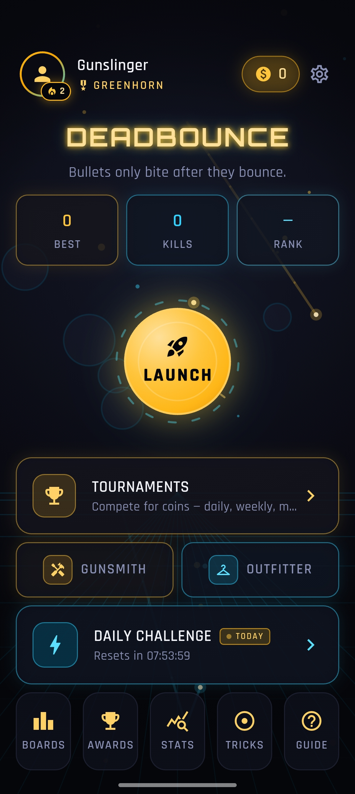 | 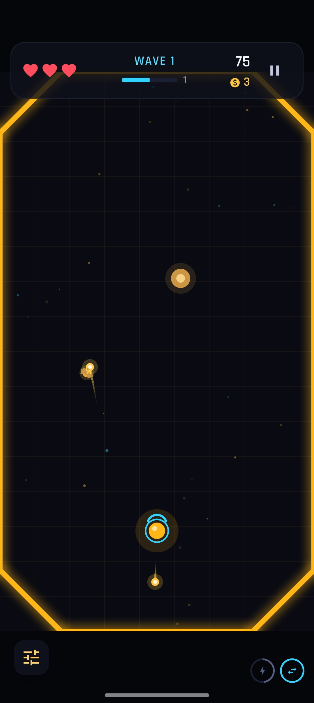 | 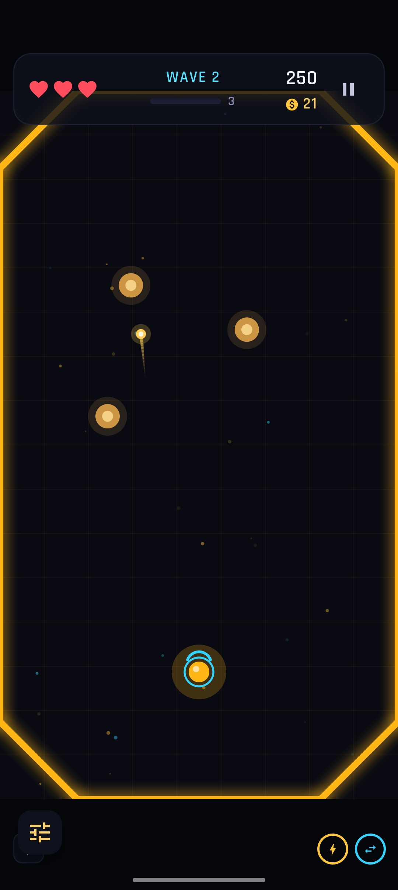 |
| **Home menu** | **Aim the ricochet** | **Survive the waves** |
| 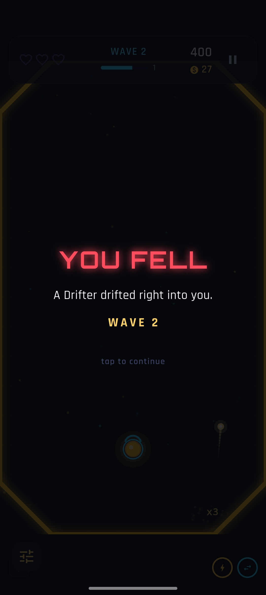 | 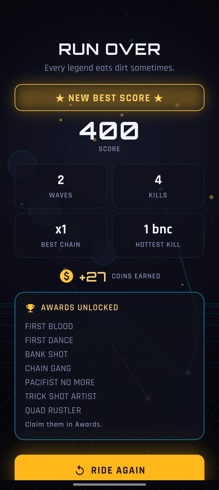 | 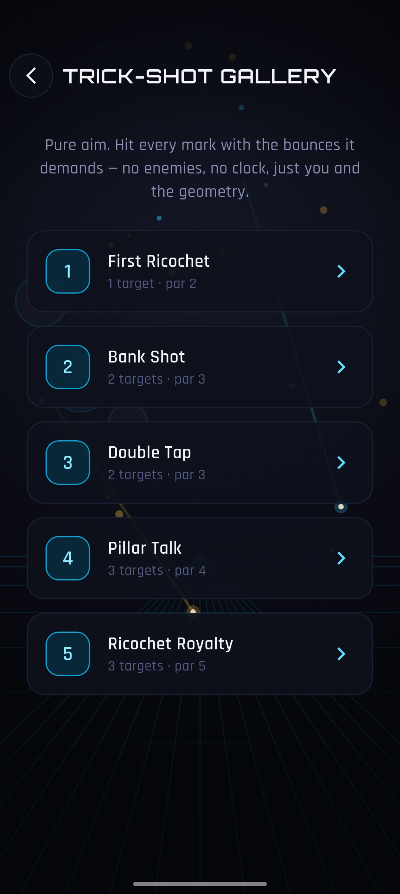 |
| **The death beat** | **Run results & awards** | **Trick-Shot Gallery** |
| 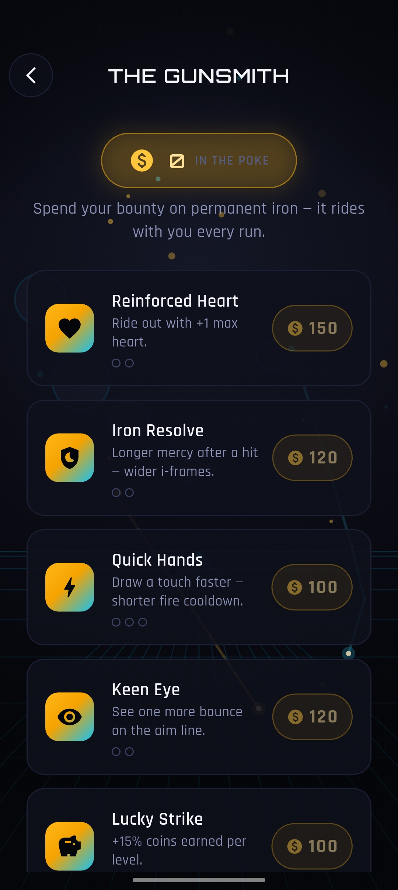 | 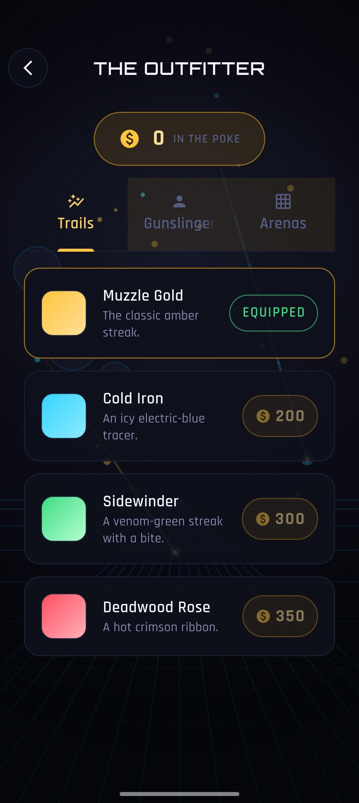 | 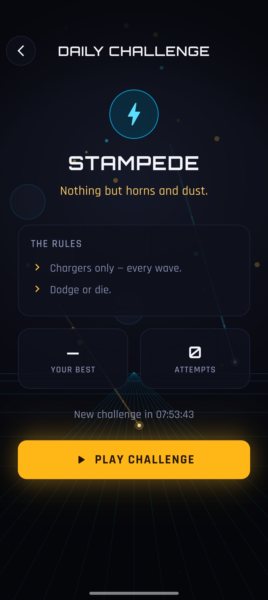 |
| **The Gunsmith** | **The Outfitter** | **Daily Challenge** |
| 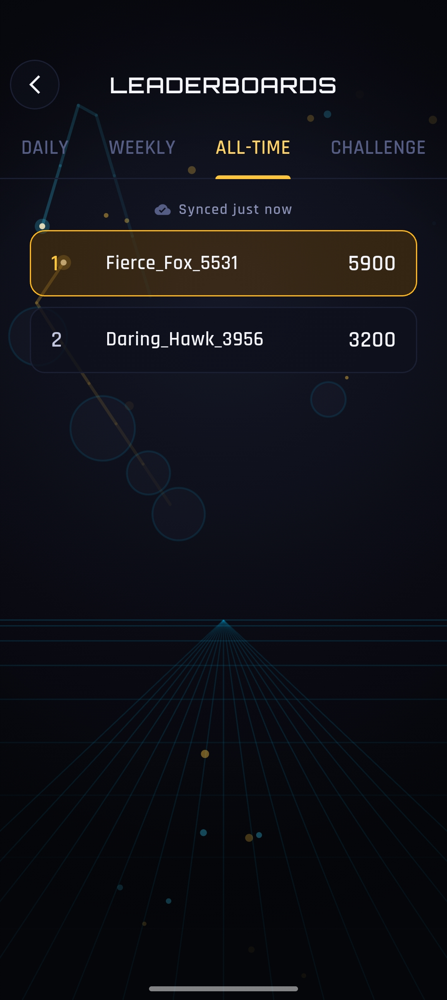 | 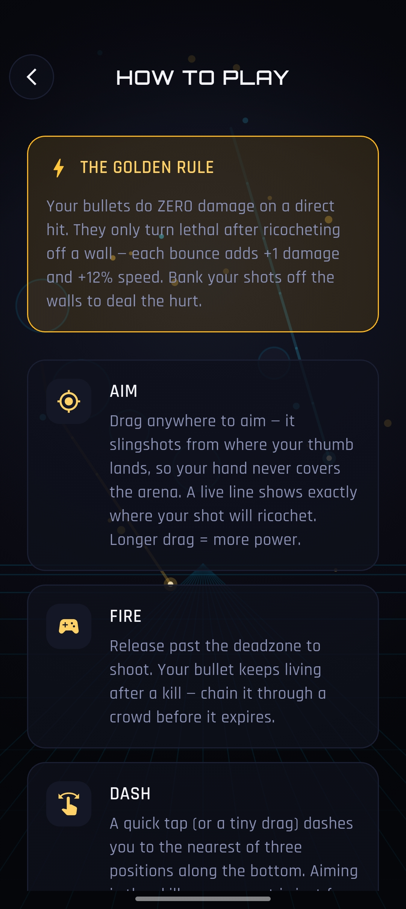 | 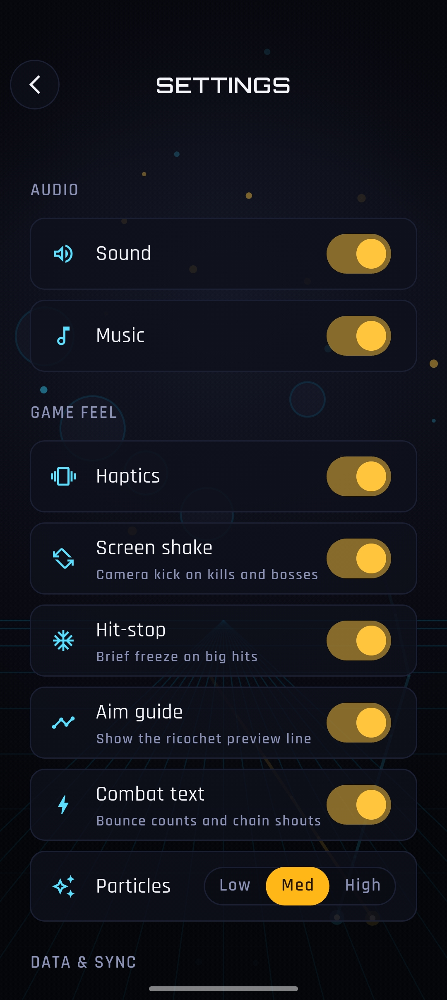 |
| **Leaderboards** | **How to play** | **Settings** |

---

## ✨ Features

### The core mechanic
- **Bullets do 0 damage on a direct hit** — they only become lethal after bouncing off walls.
- Each bounce adds **+1 damage** and **+12% speed**; bullets keep living after a kill so you can **chain** them through a crowd.
- **Drag to aim** a relative slingshot (your thumb never covers the arena) with a **live ricochet preview** that's guaranteed to match the real shot. **Tap to dash** between three anchors — aiming is the skill, not movement.

### Survive the waves
- A roster of **bounce-themed enemies**, each demanding a different angle: Drifter, Charger, Splitter, **Turret** (deadens the wall it holds), **Warden** (shielded mini-boss), Powderkeg, Sawbones (mender), Ironhide (armored), Mirror (reflective).
- Authored waves 1–15, then **endless** procedurally-scaled waves.
- Clear a wave → **pick 1 of 3 roguelike upgrade cards** (12 cards that stack and combine).

### Modes & meta
- **Daily Challenges** — one shared seed worldwide, every day, playable offline.
- **Tournaments** — rotating daily / weekly / monthly competitions for coin rewards.
- **Trick-Shot Gallery** — pure bounce puzzles; hit each target with enough ricochets.
- **Leaderboards** (daily / weekly / all-time / daily-challenge) and **24 achievements**.
- **The Gunsmith** — spend coins on permanent perks that ride into every run (coin sink / meta-progression).
- **The Outfitter** — visual-only cosmetics: bullet trails, gunslinger skins, arena themes.

### Built for your thumb
- One-handed, portrait, pick-up-and-play.
- **Fully playable offline** after first sign-in; progress syncs when you're back online.

---

## 🧱 Tech stack

| Area | Choice |
|---|---|
| UI / Game engine | Flutter + [Flame](https://flame-engine.org/) |
| State management | `flutter_bloc` (Cubits) |
| Navigation | `go_router` |
| Local database | [Drift](https://drift.simonbinder.eu/) (SQLite), one file per account |
| Auth | Firebase Auth (email/password, Google, anonymous guest) |
| Networking | `dio` (+ silent JWT refresh) |
| Config | `flutter_dotenv` |
| Animation | `flutter_animate` |
| Fonts | Orbitron + Rajdhani, **bundled** (no runtime download) |

---

## 🏗️ Architecture

**Offline-first is the spine.** Every write hits the local Drift database first,
synchronously with the UI; changes are synced to the cloud asynchronously through
a transactional **outbox**. The game is 100% playable offline after first sign-in.

- **One database file per account** (`deadbounce_<firebaseUid>.sqlite`) — accounts never mix on a shared device, and guest→linked survives for free.
- **Outbox sync** — every syncable mutation is written to `sync_outbox` in the same transaction as its domain write; a single-flight worker drains it in batches with full-jitter backoff. Sync is deduped by event id.
- **Coins are a ledger, never a mutated int** — every change is a transaction; the cached balance is updated in the same transaction.
- **Conflict policy** — the client is authoritative for its own gameplay data; leaderboards and validated aggregates are resolved remotely.

The code follows **feature-first clean architecture** (`domain → data → presentation`
per feature), with a shared `core/` for cross-cutting concerns.

```
lib/
  core/        config, network (Dio), storage (secure token), database (Drift),
               sync/ (outbox writer, worker, triggers, snapshot restorer),
               di/ (per-account SessionDependencies), router/, theme/,
               legal/ (first-run consent), widgets/ (design system)
  features/<f>/  domain → data → presentation
               f ∈ auth, game, runs, economy, streak, challenges, achievements,
                   leaderboards, tournaments, cosmetics, meta (Gunsmith),
                   profile, settings, statistics, about, home, splash, legal
assets/        audio/, fonts/, legal/ (privacy.md + terms.md), icon/
```

> `CLAUDE.md` in the repo root is the living, detailed design document — read it for
> the full mechanic/tuning/economy breakdown.

---

## 🚀 Getting started

### Prerequisites
- **Flutter 3.44+** (Dart 3.12+)
- Android SDK / a device or emulator (the game is Android-first and portrait-only)
- The API base URL set in `.env` (see below)

### 1. Install dependencies
```bash
flutter pub get
```

### 2. Configure the environment
Copy the example env and fill it in:
```bash
cp .env.example .env
```
| Key | Purpose |
|---|---|
| `API_BASE_URL_DEV` | API base URL for **debug** builds (e.g. `http://10.0.2.2:8394` for the Android emulator) |
| `API_BASE_URL_PROD` | API base URL for **release** builds (e.g. `https://deadbounce.pranta.dev`) |
| `GOOGLE_SERVER_CLIENT_ID` | Web OAuth client ID for Google Sign-In (optional; falls back to `google-services.json`) |

The dev/prod URL is chosen automatically by `kDebugMode` (see `lib/core/config/app_config.dart`).

### 3. Add Firebase config (not committed — pull from the Firebase console)
- `android/app/google-services.json`
- `lib/firebase_options.dart` (generate with `flutterfire configure`)

### 4. Run
```bash
flutter run            # debug → API_BASE_URL_DEV
```

> Drift's generated `*.g.dart` files are committed, so a fresh clone runs without
> codegen. Only after changing a Drift schema do you need:
> ```bash
> dart run build_runner build --delete-conflicting-outputs
> ```

---

## ✅ Testing & quality gate

```bash
flutter analyze        # must be clean — the commit gate
flutter test           # pure-logic + in-memory Drift tests
```

Tests cover the load-bearing logic: ricochet reflection & anti-tunneling,
trajectory↔bullet parity, damage/score scaling, the upgrade pipeline, wave scaling,
RNG/daily-seed determinism, outbox batching/idempotency, ledger balance, streak
rollover, and challenge-seed determinism.

---

## 📦 Release build

Android release signing is wired through `android/key.properties` (gitignored). When
that file is absent, the release build **falls back to debug keys**, so a local
`flutter build` still works without secrets.

```bash
flutter build appbundle --release   # AAB for Google Play
flutter build apk --release         # APK for sideloading
```

To sign with your upload key, create `android/key.properties`:
```properties
storePassword=…
keyPassword=…
keyAlias=upload
storeFile=C:/path/to/your/upload-keystore.jks
```

---

## 📄 License

Proprietary — © Pranta Dutta. All rights reserved.
